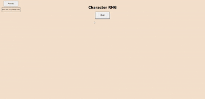
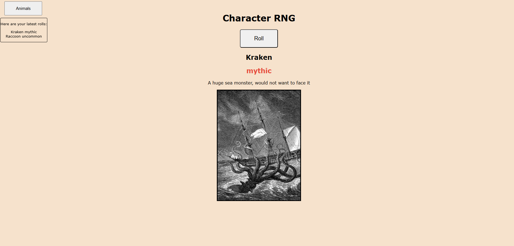

# Character RNG
one of my biggest projects to date (16/06/2026) !
a simple RNG style game where you can roll for a character(animals and anime charachter) and find out it's rarity ecc.. made entiretly in html css js with a system from common to mythic and secret rarity, based off popular RNG games Spin your favourite animal or anime character! 




### how do i try it?
You can download everything thru here and open the index.html or try it online:
[TRY HERE](https://character-rng.vercel.app/)


### features
- 2 different scenarios ( animal scenario , anime scenario )

- rarity system that ranges from common to secret (common,
  uncommon,rare,epic,legendary,mythic,secret)

- different colors for each rarity

- a history that shows you all your latest rolls

- a simple animation that lasts 3 seconds when you roll for a character

- sound for when you roll a character

- random descriptions made by me for each character

- easily addable scenarios thru JS

- roll button and button to change scenario

### how does it work?
- The rarity system: every single character is a object (contained in animals.js/anime.js), they have attributes that are name,rarity,color, description and image and weight, the weight decides the rarity of the pull, the lower it is the lower probability(chances) you will have in getting it, i make it work by basically adding up all the weights then i roll a random number in that range and i go thru the list substracting weights until i land on one
```javascript
let roll = Math.random() * totalWeight;
for (const character of currentCharacters) {
  roll -= character.weight;
  if (roll <= 0) {
    chosenCharacter = character;
    break;
  }
}
```
- The scenarios (anime/animals) instead of only having one scenario i decided to make it so u can add as many scenarios as you want by changing whats in scenarios.js and creating a new file named (scenarioName.js):
```javascript
const scenarios = [
  { name: "Animals", currentCharacters: animals, background: "#65a82d" },
  { name: "Anime", currentCharacters: anime, background: "#2d2d65" }
];
``` 
switching scenarios just changes which array gets used and updates the total weight and background color to match everything

- the spin animation basically when you click roll the result is already decided in the background but i dont instantly show it, instead i flash all random characters for 3 seconds(duration of the audio i got for the rolling), using setInterval to build up suspense like all RNG / spin games then after the 3 secs pass it stops spinning and shows the result that was already decided, this is one of the hardest parts of the code.

- for the latest rolls it's more simple i have an array that stores 10 rolls so you can see what u last rolled and when it fills up and you try to spin again it removes the oldest roll in the array

- The audio was simply declared as a const and played once the spinning 3 second section began

### What have i learned??
- how to create a RNG game by using weights instead of a bunch of math randoms

- how to separate data from the logic part(multiple js files)

- using setInterval and setTimeout since before this project i did not know how to make delayed actions

- basic DOM manipulation, however i knew already most of the basics of it.

- how to debug using the browser console 

### Conclusion
This was a lot of fun to tought out and build, probably the most tought out project i ever did, i hope you enjoyed trying to find the rarest characters. Have a good rest of your day to whoever is reading this!


